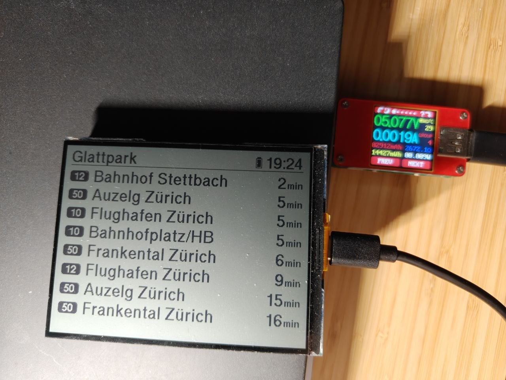

# Zurich Departures Display

A battery-friendly departure board for public transport in the Zurich area, built on the
Waveshare **ESP32-S3-RLCD-4.2** board. The device fetches live departures for a configured
station (currently *Glattpark*) and renders them on a reflective LCD, which needs no
backlight. The panel is not bistable: it does not keep its image with no power applied,
it simply needs very little power to hold one. The whole device draws roughly 10 mW, which
lets a single battery charge last about a month.



## What it does

- Fetches up to 20 departures for a station from the public
  [transport.opendata.ch](https://transport.opendata.ch) `stationboard` API every 5 minutes.
- Renders them in rows, each with the line number in a badge, the destination, and a countdown
  to departure in minutes (`now` once under 30 seconds). Fewer rows than that fit on the
  panel: the render loop stops once the next row would fall off the bottom.
- Shows the current wall clock of the data source's timezone and a battery gauge in the
  header, plus the station name.
- Sorts and filters departures so already-departed services are dropped and the list stays
  chronological.
- Drives the WiFi radio only around a fetch, and powers the station down between refreshes.

## Hardware

| Item | Detail |
| --- | --- |
| Board | Waveshare ESP32-S3-RLCD-4.2 (ESP32-S3, Xtensa dual-core, 240 MHz) |
| Display | 4.2" reflective LCD (RLCD), 400x300 px, ST7305 controller, SPI |
| Flash | 16 MB. Configured QIO in `sdkconfig.defaults`, but the active `sdkconfig` resolves to DIO (`CONFIG_ESPTOOLPY_FLASHMODE="dio"`) |
| PSRAM | Disabled on purpose - an idle 80 MHz octal PSRAM interface costs several mA and the only large allocation (the ~15 KB framebuffer) fits internal RAM |
| Regulator | TI TPS63020 buck-boost; its PS/SYNC pin must be pulled low for low-power mode (see below) |
| Battery sense | On-board battery divider on GPIO4 / ADC1 channel 3 (3.0 V = empty, 4.12 V = full) |
| Power draw | ~10 mW, giving roughly one month of runtime per battery charge |

### Display wiring

Configured in `main/user_config.h`:

| Signal | GPIO |
| --- | --- |
| DC | 5 |
| CS | 40 |
| SCK | 11 |
| MOSI | 12 |
| RST | 41 |

The panel is driven over SPI3 at 40 MHz (`RLCD_SPI_CLOCK_HZ`) in `U8G2_R1` rotation. 24/40/80 MHz
would give 5.0/3.0/1.5 ms per frame, but 80 MHz corrupted the image while every driver counter
stayed clean - a write-only bus cannot detect dropped bytes - and 60 MHz measured the same as
40 due to divider rounding.

### Low-power regulator requirement

The ~10 mW figure above depends on the TPS63020 running in power-save mode. Its
`PS/SYNC` pin selects between forced fixed-frequency PWM (high, the board default) and
power-save mode (low), which skips switching cycles at light load. Left high, the
converter burns considerably more than the rest of the system at idle and the month of
runtime is not reachable.

To get low-power mode, cut the trace tying `PS/SYNC` to its pull-up and tie the pin to
ground. This is a hardware modification to the board and cannot be done from firmware.

## Software

- **Framework:** ESP-IDF (see `.devcontainer/Dockerfile`, target `esp32s3`)
- **Graphics:** [u8g2](https://github.com/olikraus/u8g2), with a custom ST7305 panel driver
  in `components/u8g2_st7305`
- **Components:** `components/port_bsp` (board display port), `components/u8g2`,
  `components/u8g2_st7305`

### Power management

The firmware is tuned for long battery life:

- Dynamic frequency scaling between 40 MHz and 160 MHz, with automatic light sleep
  (`main/power.cpp`). This requires `CONFIG_PM_ENABLE` and `CONFIG_FREERTOS_USE_TICKLESS_IDLE`,
  which are set in `sdkconfig.defaults`; without them IDF links the whole `esp_pm` API as
  no-op stubs and the device would run at a fixed 160 MHz.
- The panel is switched to LPM (1 Hz self-refresh, command `0x39`) during initialisation, so a
  static image is held far more cheaply than the high-power (32 Hz) refresh. The image still
  requires the panel to be powered and self-refreshing; it is lost if the supply is removed.
  Initialisation follows datasheet 7.11: voltage setup on `0xC1`/`0xC2`/`0xC4`/`0xC5` with
  `0xC9`, 20 ms, `0x39`, 100 ms. The LPM *voltage values* are still the HPM set, because that
  table is panel-specific and is not in the datasheet figure - so the panel runs LPM at HPM
  source voltages and only part of the intended saving is realised. The values live in the
  `c_lpm`/`c2_lpm`/`c4_lpm` constants in `u8g2_st7305_init()`; see the comment there.
- WiFi TX power is capped at 10 dBm instead of the 20 dBm default.
- The WiFi station is stopped after every fetch and brought back up on the next refresh.
  Modem sleep (`WIFI_PS_MAX_MODEM`) is asserted per association and cleared in `wifi_stop()`,
  because it holds `ESP_PM_APB_FREQ_MAX` and would otherwise pin the clock at maximum.
- Bluetooth/WiFi/MDNS/other components are trimmed out via `sdkconfig`.
- The task watchdog's idle subscription is off
  (`CONFIG_ESP_TASK_WDT_CHECK_IDLE_TASK_CPU0/1`). Nothing here subscribes a task, and with no
  entries the driver stops the timer. While an entry existed the timer kept counting through
  the 30 s sleep and woke the chip at its 5 s timeout several times per refresh, for no benefit.
  `CONFIG_ESP_TASK_WDT_EN` stays on so an explicitly subscribed task would still be caught.
- Fewer, longer RTC RC calibration cycles (`CONFIG_ESP32S3_RTC_CLK_CAL_CYCLES=8192`) and a
  1000 Hz tick. The tick rate is the Kconfig maximum and does not matter much under tickless
  idle; it is only high so a tick cannot land inside the ~7 ms render window and split one
  sleep into two.
- During light sleep only `RST` is kept driven; `DC`/`CS`/`SCK`/`MOSI` float, giving up part of
  the 200-300 uA that `PM_SLP_DISABLE_GPIO` exists to save. `RST` must stay driven because a
  glitch on a floating `RST` can wedge the ST7305 in a state its charge-pump rails hold, which
  only removing power recovers from.

### Source layout

```
main/
  main.cpp             app entry point, display task, refresh interval
  display.cpp          framebuffer rendering, layout, battery ADC
  departures_api.cpp   HTTP fetch, clock sync from HTTP Date header
  departures_parser.cpp JSON parsing, timezone handling, sorting
  wifi_manager.cpp     WiFi station lifecycle and power saving
  power.cpp            DFS / light-sleep configuration
  user_config.h        pins, log level, power tuning knobs
  app_shared.h         shared structs and extern declarations
  secrets.h            WiFi credentials (git-ignored, local only)
  secrets.h.example    template for secrets.h with placeholder values
components/
  u8g2_st7305/         ST7305 SPI panel driver plus u8g2 glue
  port_bsp/            raw display port helper (portrait/landscape pixel writes)
  u8g2/                u8g2 graphics library
```

## Building and flashing

```bash
idf.py set-target esp32s3
idf.py build
idf.py -p /dev/ttyUSB0 flash monitor
```

Or use the provided dev container, which ships the ESP-IDF toolchain and QEMU.

## Configuration

### Credentials

WiFi credentials and site-specific values are kept out of the repository. Create your
local file from the committed template:

```bash
cp main/secrets.h.example main/secrets.h
```

Then fill in the placeholders in `main/secrets.h`:

```c
#define WIFI_SSID_VALUE "your-wifi-ssid"
#define WIFI_PASS_VALUE "your-wifi-password"
```

The clock needs no timezone configuration: the offset is taken from the ISO
timestamps of each API response, so DST changes are picked up automatically.

`main/secrets.h` is listed in `.gitignore` and must never be committed;
`main/secrets.h.example` holds the dummy values and is tracked instead. The build fails
with a missing-header error if `main/secrets.h` has not been created yet.

### Other settings

The station and API endpoint are compiled into `main/main.cpp`:

```c
const char *API_URL = "http://transport.opendata.ch/v1/stationboard";
const char *STATION_NAME = "Glattpark";
```

Tuning knobs live in `main/user_config.h`:

- `RLCD_SPI_CLOCK_HZ` - panel SPI clock in Hz (40000000). Raise only with a scope on SCK.
- `RLCD_USE_LIGHT_SLEEP` - DFS plus automatic light sleep. When 0 the CPU idles at full clock
  between refreshes; `configure_power_management()` returns early and the `sdkconfig` power
  options become inert.
- `RLCD_LOG_LEVEL` - runtime log level; `ESP_LOG_WARN` keeps the per-row chatter out of the
  UART.
- `REDUCED_WIFI_TX_POWER_QUARTER_DBM` - WiFi TX power limit in quarter-dBm (40 = 10 dBm).

## Notes

- The API URL and station name are compiled in; changing the station requires a rebuild.
- Times are stored in GMT and rendered in the timezone advertised by the API's ISO
  timestamps, so the on-screen clock lines up with the departure times.
- HTTP responses are read over plain HTTP with certificate common-name checking skipped,
  which is acceptable for this public read-only endpoint on a memory-constrained target.
